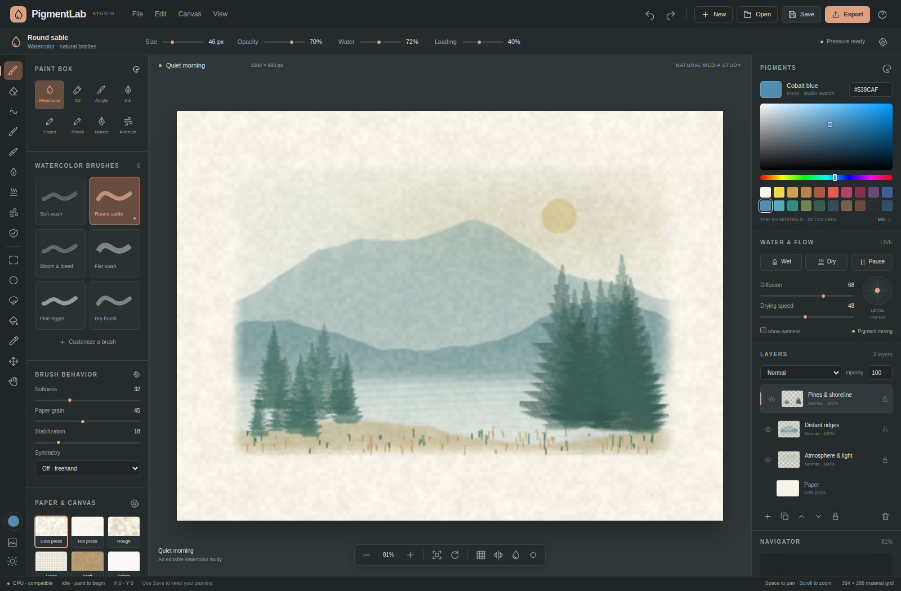

# PigmentLab

**An original, editable natural-media painting studio built with HTML, JavaScript, and WebGPU.**

PigmentLab implements its own brush engine, wet-pigment simulation, optical compositor, paper generator, document format, history, and studio UI. The application consumes nine local ESM packages; the engines do not depend on the application. There are no third-party runtime dependencies or remote assets.

This is a functional independent implementation inspired by the natural-media painting category, not a complete or compatible reimplementation of Rebelle. It does not contain Escape Motions code, assets, proprietary technology, or file-format support. See [the feature matrix](docs/FEATURES.md) for exact boundaries.



## Run

Node.js 20 or newer:

```sh
cd PigmentLab
npm start
# Open http://localhost:4173
```

No install is needed to run the source application: its import map resolves the local packages. The checked-in `dist/PigmentLab.html` is a self-contained alternative with JavaScript and CSS inlined. Local-file browser restrictions vary; serving the application on localhost is recommended. WebGPU initialization is attempted when available; failure selects the CPU backend and displays the reason. A CPU fallback is not GPU verification.

For local package imports in Node, tests, or rebuilding:

```sh
npm install --offline --ignore-scripts
npm run check
npm test
npm run build
node examples/headless.mjs examples/Headless-study.pigment
```

The build creates `dist/index.html`, `dist/pigmentlab.js`, `dist/style.css`, and `dist/PigmentLab.html`. Copy the complete `dist/` directory to a static host, or serve it with `node scripts/serve.mjs --dist`. No server-side application is required. Hosting has not been provisioned by this source delivery.

## Painting workflow

The studio opens with an original three-layer, editable watercolor landscape. Choose **File → New painting** for a blank document, select a medium and preset in the left dock, and paint on the paper. Brush size, loading, water, opacity, grain, thickness, angle, spacing, and stabilization are editable. Pen pressure and tilt are consumed when delivered by the browser.

Watercolor carries mobile pigment and water; drying transfers pigment into a fixed deposit. The water brush can rewet deposited pigment. Paper height and absorption, granulation, diffusion, and two-axis paper tilt alter the field evolution. Oil/acrylic and the palette knife add a height field for impasto shading. These are explicit numerical approximations, not a measured physical-material solver.

Use the layer dock to add, duplicate, reorder, rename, hide, delete, lock, alpha-lock, and blend paint layers. Double-click a layer name to rename it. Selections constrain brush operations and fills. Resist masking blocks deposition and transport. The canvas supports pan, zoom, view rotation, symmetry, image references, and touch gestures. Mobile drawers expose the same editing controls.

**Save the `.pigment` project to retain editable material state.** PNG/JPEG/WebP exports are flattened pictures. The heightmap export is an 8-bit normalized PNG, not a high-dynamic-range displacement asset. Painting-process recording exports a browser-supported real-time video; it is not a stroke replay or accelerated time-lapse format. Autosave uses IndexedDB when the origin permits browser storage and is not a substitute for downloading projects.

## Independent packages

| Package | Responsibility |
|---|---|
| `@pigmentlab/core` | Deterministic math, event/queue primitives, tile indexing, dab binning, selection masks |
| `@pigmentlab/pigments` | Three-band K/S-inspired mixing, color conversion, palette and blend functions |
| `@pigmentlab/paper` | Seeded procedural paper topology and absorption fields |
| `@pigmentlab/brushes` | 23 presets, 17 tool identifiers, pressure/tilt stroke sampling, packed dabs and symmetry |
| `@pigmentlab/kernels` | Standalone WGSL material compute source: stamping, transport, material operations |
| `@pigmentlab/simulation` | Matching CPU/GPU surface APIs, resource ownership, fill, transforms and raster import |
| `@pigmentlab/renderer` | WGSL/CPU compositors, impasto/wetness views, thumbnails, image and heightmap export |
| `@pigmentlab/document` | Lossless float-bit project codec, metadata validation, history, autosave |
| `@pigmentlab/ui` | Original icons, commands, dialogs, range controls, canvas input, viewport and studio CSS |

All packages are MIT-licensed ESM packages with local workspace dependencies. `release/packages/` contains the nine npm tarballs; these are packaged, **not published to npm**. Install all tarballs together in a consuming project so the local exact-version dependencies can resolve without the registry. The UI stylesheet is exported as `@pigmentlab/ui/style.css`.

## Validation

The delivery includes **42 passing Node engine/static-shader tests** and **54 passing Chromium CPU-backend integration checks**. The independent browser example and a separate npm consumer also passed. The browser suite exercises real pointer painting, lossless history, selections/masking, impasto, layers, project download/reopen, flattened exports, reference images, custom presets, video recording, and responsive layout. Screenshots and machine-readable results are in `artifacts/`.

The test environment did not expose a WebGPU adapter. Actual GPU pipeline compilation, CPU/GPU numerical comparison, pen hardware, persistent-origin autosave, and cross-browser/hardware performance remain unverified. Run the included adapter-backed suite at `http://localhost:4173/tests/gpu-smoke.html`; an unavailable adapter is explicitly **SKIPPED**, not passed. WGSL source lint is not a shader compiler.

```sh
# Optional browser test tools; these are not runtime dependencies.
python -m pip install playwright==1.51.0
python -m playwright install chromium
python tests/browser_test.py --inline
```

Prepared GitHub Actions checks cover Node and CPU Chromium tests. They were not run on GitHub as part of this delivery. See [the test report](docs/TEST_REPORT.md).

## Engineering documentation

- [Architecture and numerical model](docs/ARCHITECTURE.md)
- [Package API and embedding](docs/API.md)
- [Binary project format and validation](docs/FORMAT.md)
- [Implemented features and product boundaries](docs/FEATURES.md)
- [Validation report](docs/TEST_REPORT.md)
- [Independent browser painting example](examples/minimal-paint.html)
- [Headless material-painting example](examples/headless.mjs)

## References and provenance

External product scope reference: [Escape Motions — Rebelle](https://www.escapemotions.com/products/rebelle/about). Shader-language reference: [W3C WebGPU Shading Language](https://www.w3.org/TR/WGSL/). All application art is procedurally authored in this repository; no Rebelle screenshots, product assets, or copied artwork are embedded. The supplied ChatGPT share link did not expose its conversation body to the retrieval environment; this implementation follows the explicit user request rather than claiming access to that hidden content.

Copyright © 2026 PigmentLab contributors. See [LICENSE](LICENSE).
